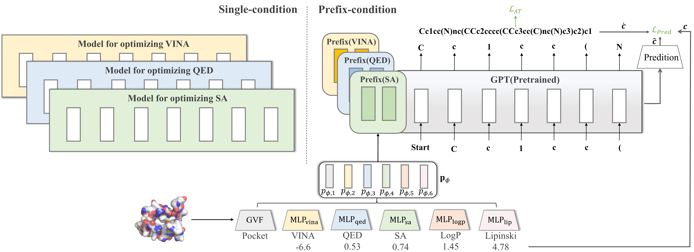

# PrefixMol: Target- and Chemistry-aware Molecule Design via Prefix Embedding
This is my own re-implemented version of Prefix Mol

  - Original Code: https://github.com/A4Bio/PrefixMol
  - Paper: https://arxiv.org/abs/2302.07120



## Installation

### My way
```bash
# Major package
conda create -n prefixmol transformers deepchem=2.7.1 pytorch3d=0.7.2 jupyter openbabel -c pytorch3d
conda install rdkit=2022.3.1 -c rdkit
# install other missing packages vai conda 
pip install nni partialsmiles # if you do this, you cannot use conda-pack to pack this environment
```

### I have prepared a conda-packed environment, while installing the nni and partialsmiles packages in the PrefixMol

``` bash
mkdir ~/software/miniconda3/envs/prefixmol # use your own env
tar -xzvf prefixmol.tar.gz -C ~/software/miniconda3/envs/prefixmol
conda activate prefixmol
```

<details><summary>🔎 Tips for pytorch3d installation</summary>
Notice that we recommend using the following steps to install pytorch3d 👐 

1. install the following necessary packages.
``` 
conda install -c fvcore -c iopath -c conda-forge fvcore iopath
```
2. Find the <a href="https://github.com/facebookresearch/pytorch3d/releases">suitable version</a> with your environment 
3. Git clone the resporitory and then run the command as follows for example.

``` bash
cd pytorch3d
python setup.py install
```
</details>


## Datasets

Please refer to [`README.md`](./data/README.md) in the `data` folder.

## Training
We used <a href="https://pytorch.org/docs/stable/generated/torch.nn.parallel.DistributedDataParallel.html?highlight=distributeddataparallel#torch.nn.parallel.DistributedDataParallel">DDP</a> to accelerate the training process. Here are some command examples FYR.

```bash
# 4 GPUs
CUDA_VISIBLE_DEVICES="0,1,2,3" python -m torch.distributed.launch --nproc_per_node 4 train.py
# 8 GPUs
CUDA_VISIBLE_DEVICES="0,1,2,3,4,5,6,7" python -m torch.distributed.launch --nproc_per_node 8 train.py

```

## Testing
When it comes to testing process, we loaded the checkpoint.pth and used 1 GPU to test the result.
```
CUDA_VISIBLE_DEVICES="0" python -m torch.distributed.launch --nproc_per_node 1 test.py
```

## 🔖 Tips
When running the codes, the path where the code appears is recommended to be changed to the path you need at the moment.

## Citation
```
@article{gao2023prefixmol,
  title={PrefixMol: Target-and Chemistry-aware Molecule Design via Prefix Embedding},
  author={Gao, Zhangyang and Hu, Yuqi and Tan, Cheng and Li, Stan Z},
  journal={arXiv preprint arXiv:2302.07120},
  year={2023}
}
```

## Contact 
Zhangyang Gao (gaozhangyang@westlake.edu.cn)
Yuqi Hu (hyqale1024@gmail.com)

